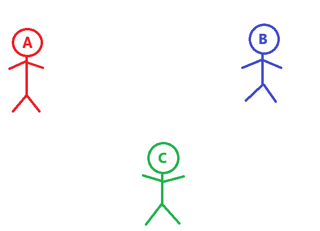
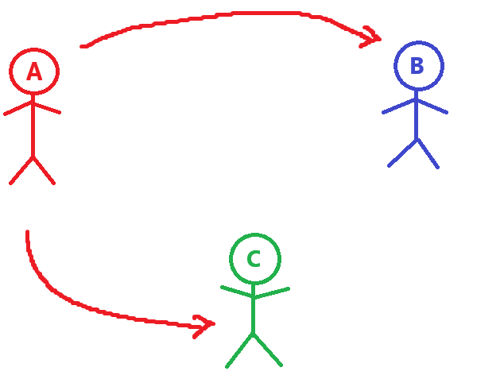
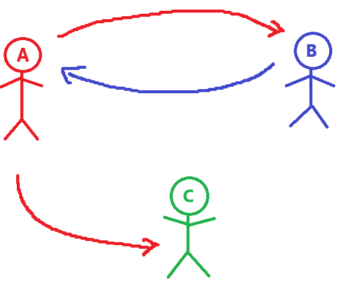
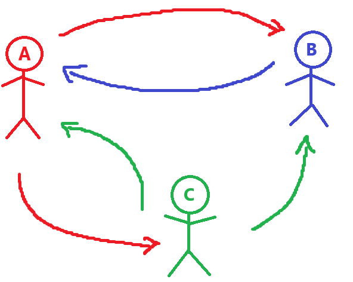
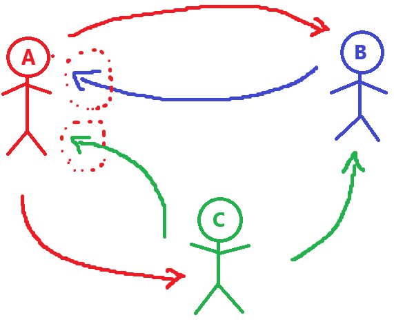
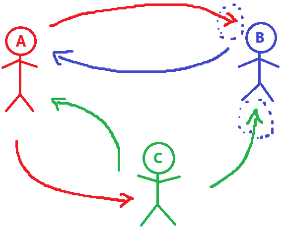
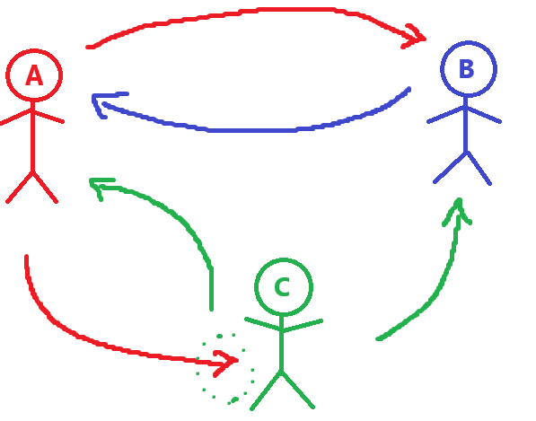

# Catch the Thief - Como funciona?

Para entender como a teoria dos grafos ajuda a resolver um crime, vamos pensar na seguinte situação:

Há 3 suspeitos, (A, B e C), e cada um faz as seguintes afirmações:

<li> A - Eu não sou o ladrão
<li> B - A é o ladrão
<li> C - Eu não sou o ladrão

E é dito que <b>apenas 1</b> deles está dizendo a verdade. Parece um problema bobo e fácil de lógica, que depois de alguns segundos será possível chegar na conclusão de que:

<li> Se A fosse o ladrão, B e C estariam dizendo a verdade
<li> Se B fosse o ladrão, A e C estariam dizendo a verdade
<li> Se C fosse o ladrão, apenas o A estaria dizendo a verdade

Logo, já que apenas 1 está dizendo a verdade, nosso ladrão só pode ser o C. 

Como dito antes, parece ser algo bem simples certo? Porém e se fossem 10 suspeitos e cada um fizesse uma afirmação, e apenas um estivesse dizendo a verdade. Quanto tempo levaria?

Um tempinho, porém, dá pra resolver de uma forma mais fácil. Para isso, bastaria ver o problema como se fosse um grafo! Vamos analisar o nosso problema anterior, 3 suspeitos:

Pensaremos em cada suspeito como um vértice, e cada acusação como uma aresta direcionada. Nossa primeira afirmação é:

<li> A - Eu não sou o ladrão

Vamos considerar que, dizer isso, significa que o A está acusando todos os outros suspeitos, B e C. Logo nossas primeiras arestas ficariam assim:

Agora seguindo para a segunda afirmação:

<li> B - A é o ladrão

B está apenas acusando A, logo teria apenas uma aresta saindo dele:

E por fim, a terceira afirmação:

<li> C - Eu não sou o ladrão

Segue o mesmo princípio do A:

Agora que temos nosso <b>grafo direcionado</b> construído, resta apenas uma única informação que mata o problema: Quantos estão dizendo a verdade.

No nosso caso é apenas 1, portanto basta ver no grafo qual suspeito tem exatamente apenas 1 aresta CHEGANDO nele:

Para o A, temos 2 arestas:

Para o B, também temos 2 arestas:

E para o C, apenas 1 aresta:

Ou seja, quando o <b>GRAU DE ENTRADA</b> for igual ao número de pessoas que estão dizendo a verdade, temos o culpado.

E assim, chegamos na mesma conclusão, que apenas o C, pode ser o culpado.

Caso tivessem 2 suspeitos nessa situação, não teria como saber quem de fato é o culpado, porém com certeza é um deles.

Isso se aplica para quantos suspeitos forem, sejam 3, 10 ou 50, uma vez tendo suas acusações, e quantos estão dizendo a verdade, um grafo direcionado consegue dizer quem é(são) o(s) culpado(s). 

Esse problema foi retratado no seguinte vídeo: <a href="https://www.youtube.com/watch?v=TwHy2DuWB3k&t=17s">How To Solve A Crime With Graph Theory</a>.

Claro que na vida real é bem difícil saber quantos estão dizendo a verdade... 🧐