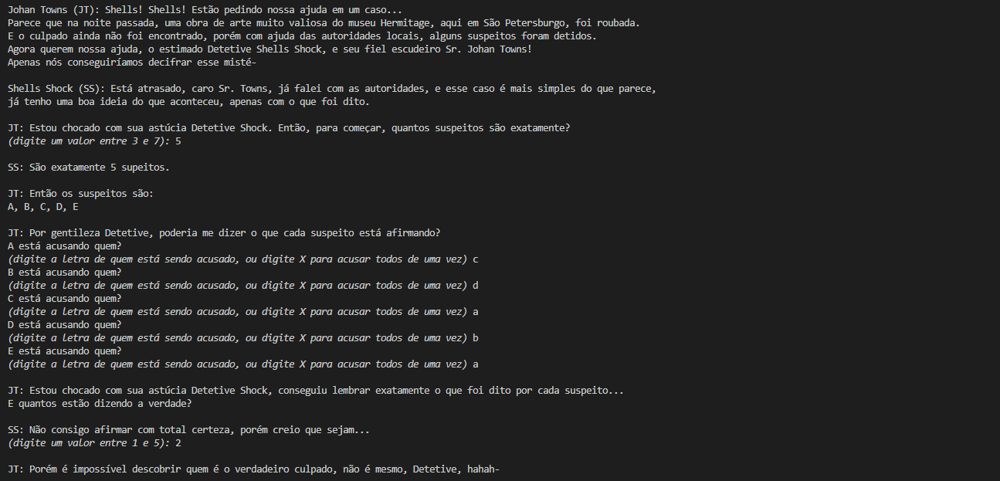
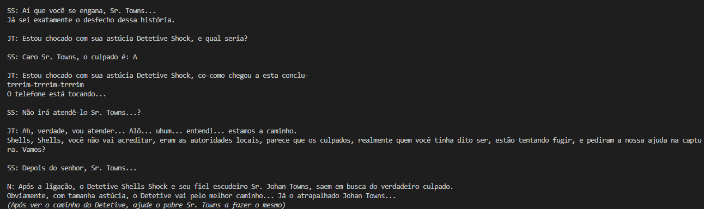
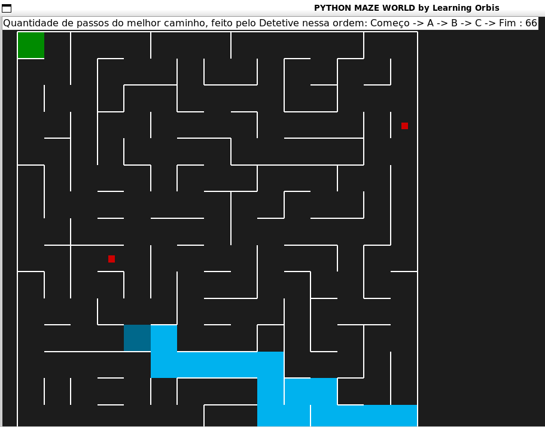
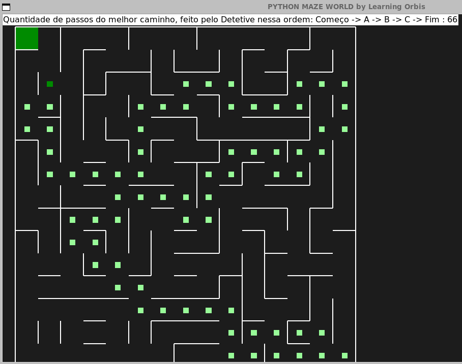

# Catch the Thief

**Número da Lista**: 26 
**Conteúdo da Disciplina**: Grafos 1 

## Alunos
| Matrícula | Aluno |
| -- | -- |
| 211031575  |  Ana Karoliny de Souza Cavalcanti |
| 211031056  |  Guilherme de Sá Gonçalves |

## Sobre 
O "Catch the Thief" é um joguinho que explora a teoria dos grafos para resolver um crime. Basicamente o jogo é dividido em 2 partes:

A primeira é uma entrevista com o usuário, sendo o incrível Detetive Shells Shock, a cerca dos suspeitos: Quantos são, quem está acusando quem, e quantos estão dizendo a verdade. Apenas com essas 3 informações é possível dizer o(s) culpados(s) apenas utilizando a teoria de grafos.

Já na segunda parte, o usuário controlará, o ajudante do Detetive, o Sr. Towns, a pegar os verdadeiros culpados, em um labirinto feito em Pyamaze.

## Screenshots

## Instalação 
**Linguagem:** Python 
**Versão:** 3 ou superior 

Ter no mínimo a versão 3 do Python.

Instalar a biblioteca Pyamaze na máquina:

<i>pip install pyamaze</i>

Recomendamos abrir pelo VsCode para facilitar a visualização do código e rodar (clicando no play)

## Uso 
Uma vez que executar o código, toda aplicação será via terminal, sendo necessário ler as instruções que forem aparecendo.

## Link para o vídeo de explicação do trabalho
<a href = "https://drive.google.com/file/d/1bpXAZu65bnVgZMid9Fyh4ounrfUqZCJ_/view?usp=sharing">Explicação Trabalho (Drive)</a>

<a href = "https://youtu.be/WqJcgC5K3Dw">Explicação Trabalho (YouTube)</a>

## Outros 
A explicação de como a teoria dos grafos ajuda nesse problema se encontra [AQUI!!!](Explicacao.md)